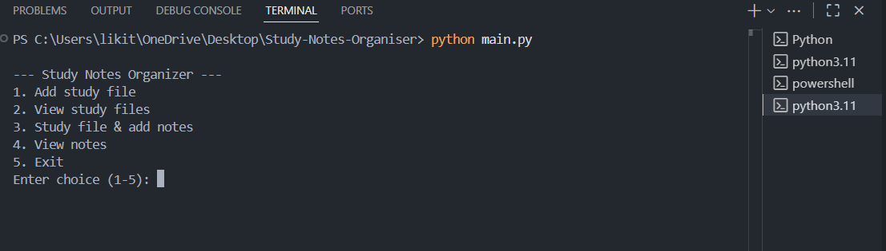
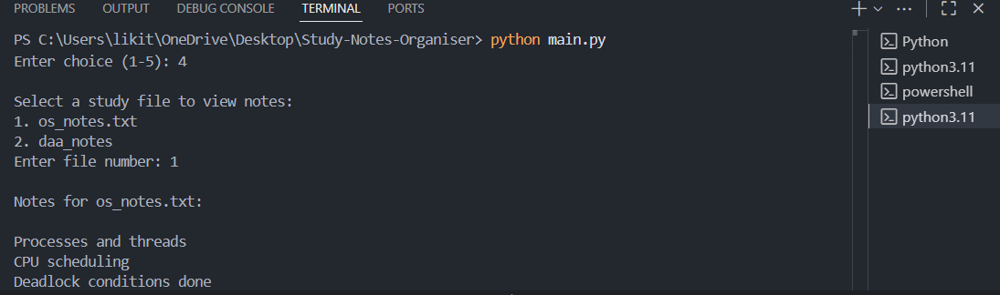

# Study Notes Organizer 

A simple Python command-line application that helps students organize study files and take notes while studying.

This project allows users to:
- Create subject-wise study files
- Add important points while studying
- View saved notes anytime
- Store notes persistently using files

---

## Features 

- Menu-driven command line interface
- Add multiple study files (subjects)
- Add important notes line by line
- View notes for each subject
- Notes are saved permanently
- Simple and beginner-friendly design

---

## Technologies Used 

- Python 3
- File Handling
- OS module
- Command Line Interface (CLI)

---

## Project Structure 
```
Study-Notes-Organizer/
│
├── main.py          # Main Python program
├── files.txt        # Stores study file names
├── notes/           # Folder that stores notes for each subject
│   ├── notes_os_notes.txt
│   └── notes_daa_notes.txt
└── README.md        # Project documentation
```


---

## How to Run the Project 

1. Make sure Python 3 is installed
2. Open a terminal in the project folder
3. Run the following command:
```bash
python main.py
```
---
## Validation

- Tested the application through repeated usage across multiple subjects.
- Verified correct creation, storage, and retrieval of notes without data loss.
- Used during coursework to ensure practical usability.

---

## Sample Usage 

1. Run the program:
```bash
python main.py
```
2. Choose an option from the menu:
- Add a new study file (subject)
- Add important notes while studying
- View saved notes anytime

---

## Future Improvements 

- Add search functionality for notes
- Add date-wise filtering
- Convert this CLI app into a GUI or web app
- Add user login system


## Sample Output
```text
--- Study Notes Organizer ---

1. Add study file
2. View study files
3. Study file & add notes
4. View notes
5. Exit

Enter choice (1-5): 1
Enter subject name: OS
Study file 'OS' added successfully

## Screenshots

### Main Menu


### View Notes


### Exit Option


